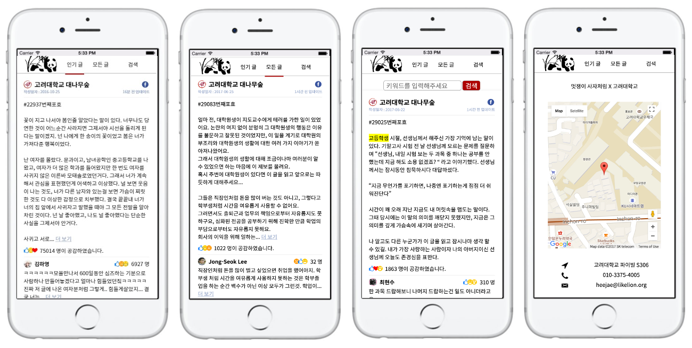

# 신촌 해커톤 발표자료

신촌의 여러 대학이 참여했던 신촌 해커톤에 안암의 고려대학교가 초청받게 되어 함께 참가했습니다.

대학생들 사이에서 인기있는 익명 게시판인 대나무숲!

그 중 폭발적인 인기를 끌었던, 혹은 많은 사람들의 관심을 받았던 게시글만 따로 크롤링하여 보여주는 서비스를 개발해보았습니다.

유저들은 기존 다른 크롤링 서비스와는 달리 재미나 감동이 검증된 게시물들만 읽을 수 있고, 그러한 게시물들을 다시 키워드를 통해 검색하거나 학교별로 모아서 볼 수 있게끔 개발해보았습니다.

모바일 환경을 주 타겟으로 삼았으며 Rails를 사용하여 모바일 웹을 타겟으로 하여 개발하였습니다.

Facebook API를 비롯한 각종 오픈 소스들을 활용하여 개발했으며, 이 서비스의 주 기능이 되는 크롤링 기능은 Rails의 Action Job을 활용하여 백그라운드 작업으로, 사용자의 활동과는 별개로 실행되게끔 개발해보았습니다.

차후 React Native를 사용하여 Android/iOS 앱으로 만들 계획에 있습니다. :)
